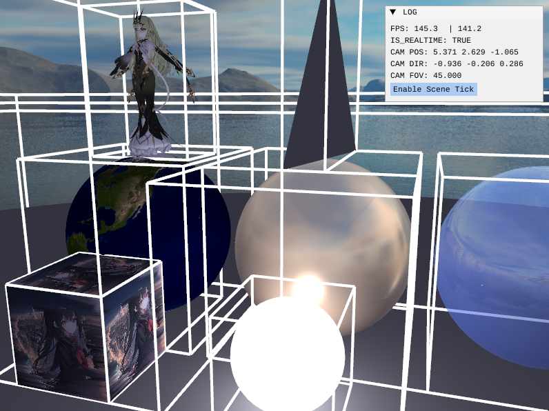
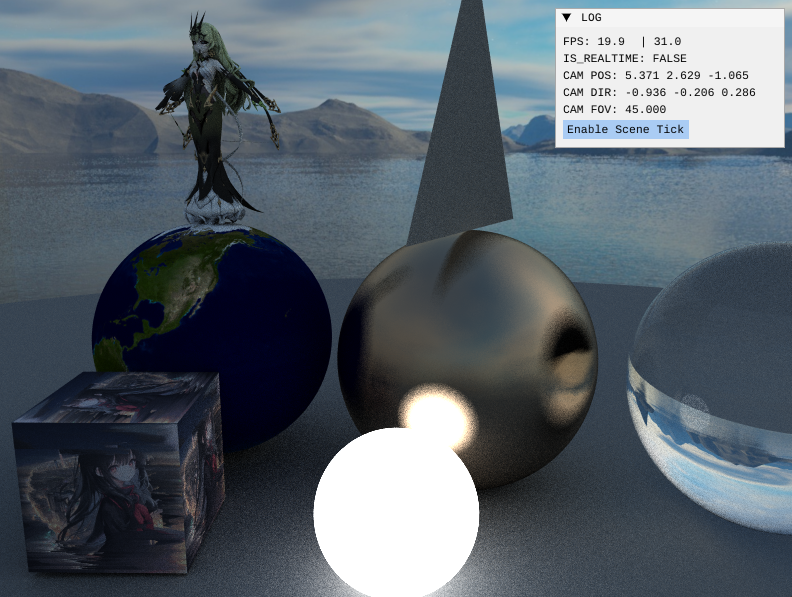
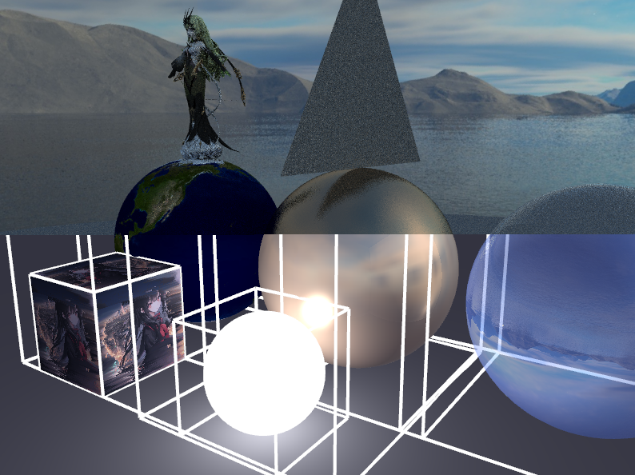
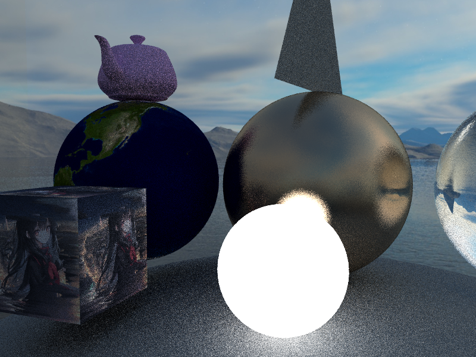

# RayTracingInRT

## About it
It's an openGL rendering application which combines traditional rasterization pipeline (openGL), software ray-tracing (adapted from Ray-tracing in one weekend series), and real-time ray-tracing using compute shader as accelerations.

It uses two-layered BVH acceleration for ray-object hit calculation (TLAS & BLAS), it supports meshes which can be loaded from \.obj and textures from \.png or \.jpg. It also supports dynamic scenes with moving objects (by only updating TLAS while BLAS keeps static).

## Controls
You can press 1/2/3 to switch between default rasterization/ CPU ray-tracing/ GPU accelerated ray-tracing. You can also see how TLAS volumes look like and how they update by clicking 'enable scene tick' option.

  
  
  
  
  

## Future ideas
I'm likely not going to continue developing this application because I believe that RTX and Vulkan would offer superior capabilities for real-time ray tracing compared to OpenGL & compute shaders. While the TLAS-BLAS structure does provide a way to keep the scene dynamic with relatively low overhead, it limits the scene's mesh to a static structure. For example, ray tracing skeletal meshes with skinned vertices becomes impractical. I think leveraging GPU parallelization for BVH construction or directly utilizing RTX APIs might be a more effective solution.
