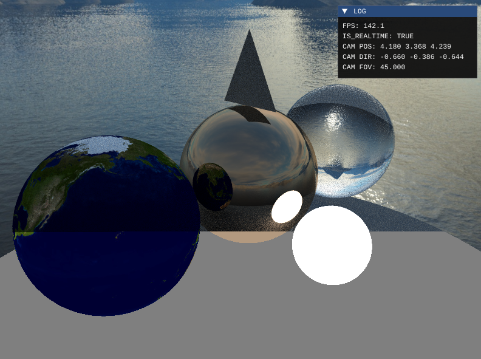
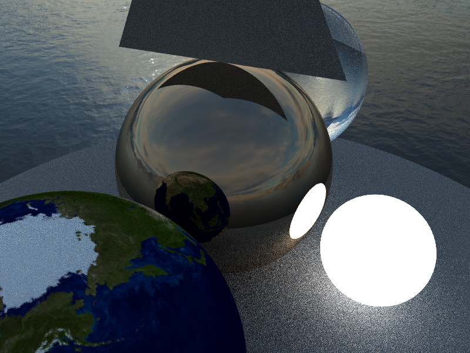
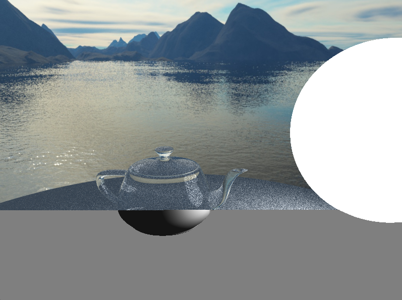
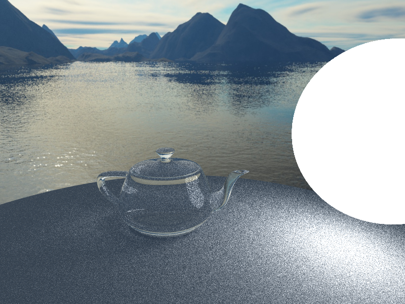

# RayTracingInRT

## About it
Still coding for this. It's an openGL rendering application which combines traditional rasterization pipeline (openGL), software ray-tracing (adapted from Ray-tracing in one weekend series), and real-time ray-tracing using compute shader as accelerations.

## Controls
You can press 1/2/3 to switch between default rasterization/ CPU ray-tracing/ GPU accelerated ray-tracing.

